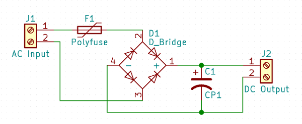

# upy-furnace
Furnace telemetry via MQTT on ESP8266 and Micropython

This project uses submodules. Clone with `git clone --recurse-submodules` or `git submodule init` in each submodule directory.

## BOM
- 1x esp8266 development board with USB - I used a nodemcuv2 variant
- 1x tmp102 I2C temperature sensor
- 1x bme280 I2C temperature/humidity/pressure sensor
- 2x 10K resistors for pullups

### Power Supply
The furnace has low voltage AC available for the thermostat, so might as well tap into it (at your own risk).  
Have a spare fuse handy for when you mess up (often an automotive blade-type fuse).

- 1x ~40V &rarr; 5V USB Buck Converter
- 1x bridge rectifier (or some diodes)
- 1x electrolytic cap, at least 50V, 100V would be better (I used a 470uF)
- 1x current protection device. A small fuse or a PTC would be a good idea. (I used a 250mA PTC)
- 1x terminal strip - 2 or more positions. Makes hookup somewhat easier.

### I2C over telephone (RJ14) scraps
RJ14 is the 2-line variant of the typical telephone connector.  
They contain 4 wires (6P4C), as opposed to the single-line, 2-wire RJ11.  
Look for 4 gold contacts in the connectors on your junk-bin cables.

Ethernet (8P8C) cables and connectors would work as well.

- 3x Surface-Mount RJ14 boxes
- 2x Telephone RJ14 cables
- 1x Dual or Triple gang RJ14 splitter

## Wiring

### Power Supply
On the furnace controller board, there will be 24VAC (nominal) between the "R" and "C" terminals. Run wires from "R" and "C" to the terminal block.  
This is unfiltered, unregulated, straight off a transformer power, so don't trust the nominal 24V - mine runs about 28VAC.  
Don't forget that rectification is going to result in a VDC = VAC * 1.414 (- a couple diode drops) - mine runs about 38VDC

The buck converter expects DC input, so I put together a small rectifier board with parts I had at hand.
- The AC Input connects to the terminal block across the 24VAC from "R" and "C" (polarity does not matter)  
- The DC Output connects to the buck regulator inputs (ensure correct polarity)

Then the buck regulator outputs 5VDC to the USB jack, which can be cabled to the esp8266 USB connector.

### Sensors
I used typical 2 pair (RJ14 - 6P4C) telephone wiring and connectors.

- Red &rarr; 3V3
- Black &rarr; GND
- Green &rarr; SCL + pullup to Red
- Yellow &rarr; SDA + pullup to Red

The sensors were mounted inside the surface mount jacks.  
The last surface mount jack was used to break out the connections to the esp8266.  
The splitter was attached to the jack on the esp8266, with separate wires running to the upper and lower sensors.

## Getting Started
- Install micropython to your board https://docs.micropython.org/en/latest/esp8266/esp8266/tutorial/intro.html
- `cp config.json.example config.json` and edit config.json to match your environment
- Upload the sources to the device - load.sh is an example using [ampy](https://github.com/adafruit/ampy) to load them over serial

## TODO
- Configurable I/O Pins
- Improve MQTT configurability
- Improve reusability
